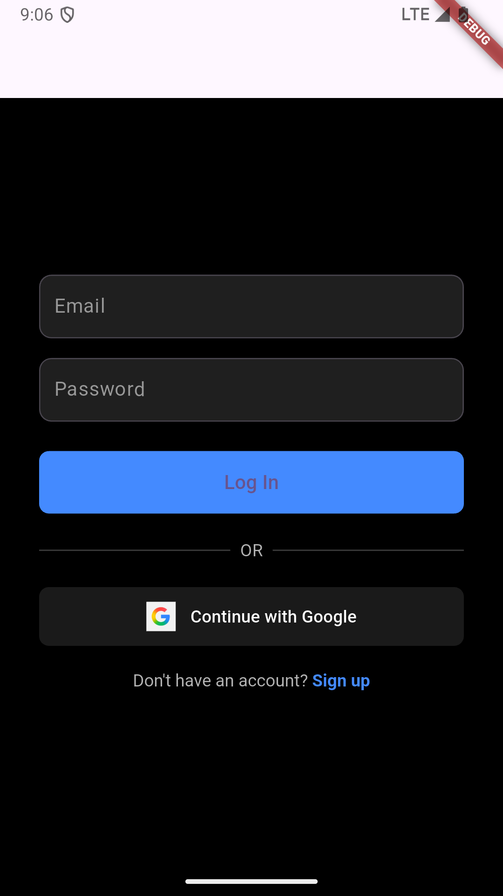
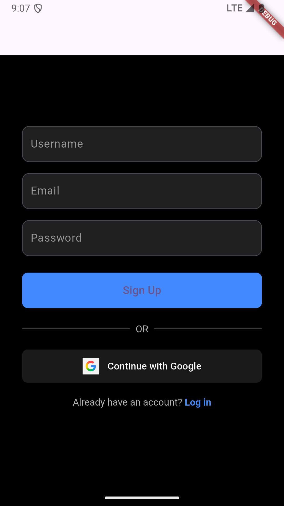
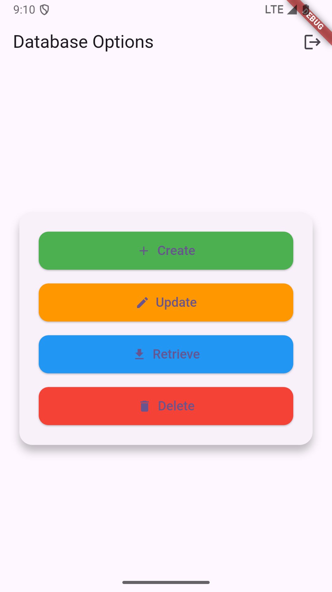

# 📱 DataLogin

**DataLogin** is a beginner-friendly Flutter app that demonstrates user authentication using Firebase and CRUD operations using Firestore. It has a simple and clean UI to help new developers learn Flutter, Firebase Auth, Firestore, and GetX navigation.

---

## ✨ Features

- 🔐 Email & Password Login/Signup
- 🔒 Google Sign-In
- 📦 Firestore Integration
- 🧾 Perform CRUD operations (Create, Read, Update, Delete)
- ⚡ Clean, responsive UI using GetX

---

## 📸 Screenshots

### 🔑 Login Page


---

### 📝 Sign Up Page


---

### 🧰 Database Options Page


---

## 🧩 Packages Used

```yaml
cupertino_icons: ^1.0.8
flutter_native_splash: ^2.4.4
firebase_core: ^3.14.0
firebase_auth: ^5.6.0
cloud_firestore: ^5.6.9
get: ^4.7.2
