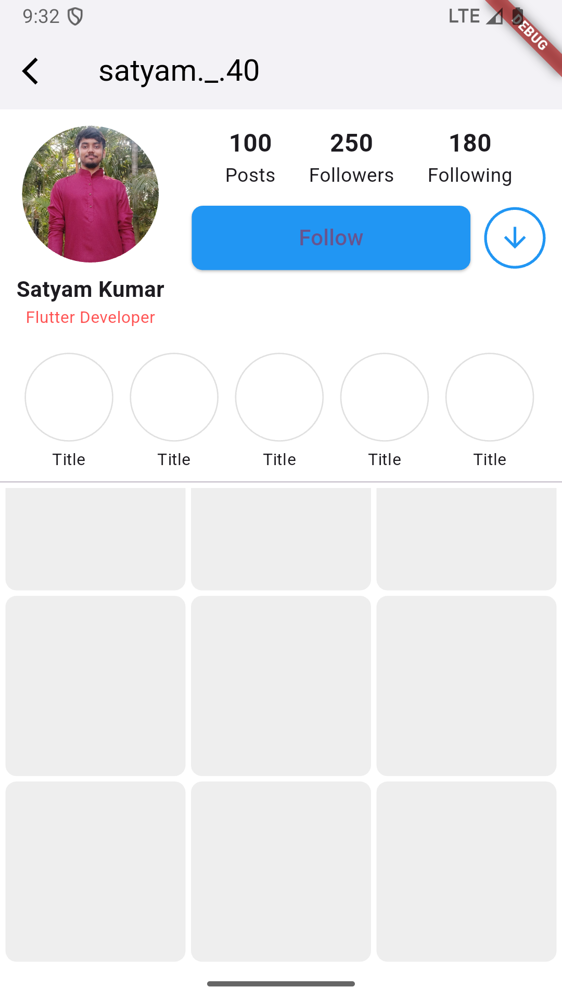

# insta_ui

A clean and responsive Instagram-like profile UI built using **Flutter**.  
This project is a basic design clone of an Instagram profile screen, ideal for beginners to learn Flutter layout, widgets, and UI building.

---

## 🔥 Features

- Instagram-style profile layout
- Circular profile picture
- User info and description
- Followers / Following / Posts count
- Custom follow button
- Horizontal scrollable story highlights
- Grid-style post gallery
- Fully responsive using basic widgets

---

## 📲 Screenshot

Here’s how the UI looks in action:

---

## 🚀 Getting Started

### Prerequisites
- Flutter SDK
- Android Studio or VS Code
- A connected device or emulator

### Run Locally

